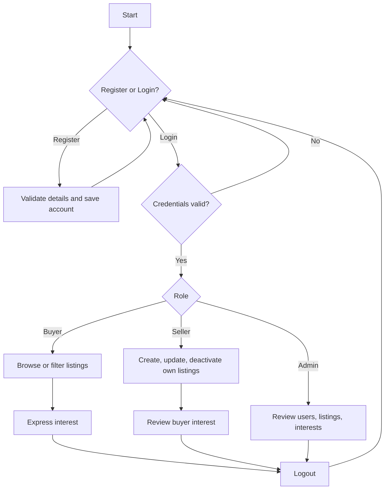
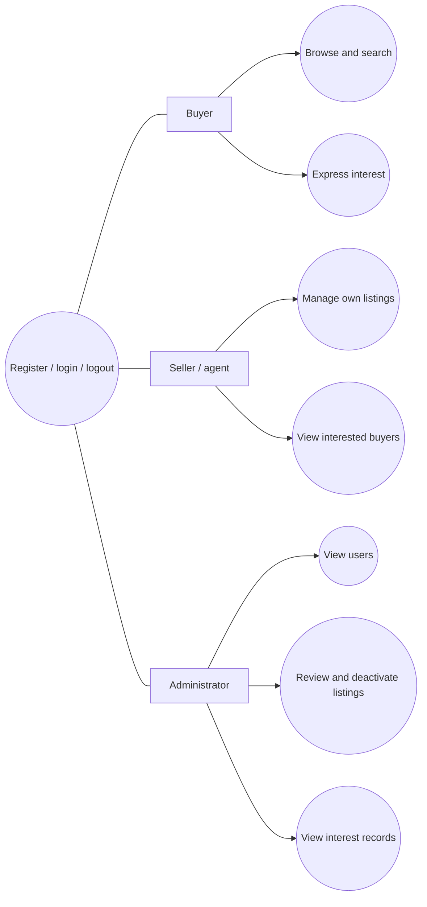
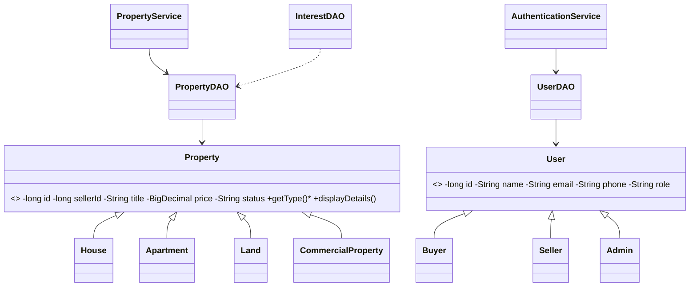
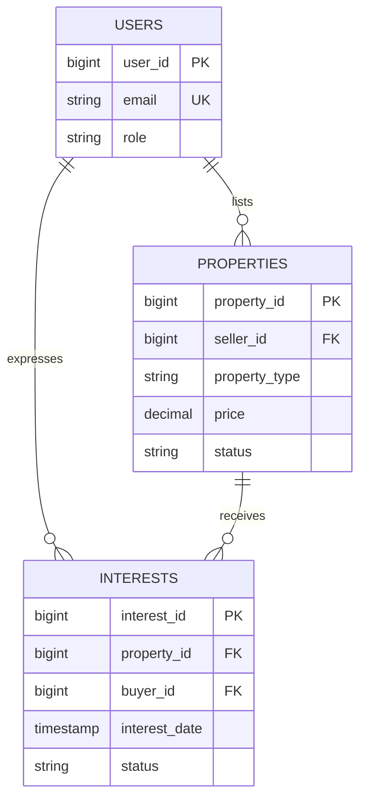
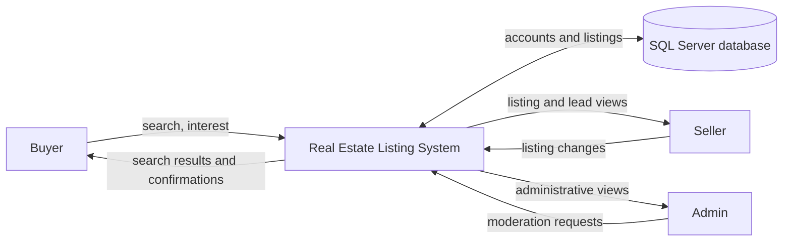

# System diagrams

## Workflow flowchart

```mermaid
flowchart TD
 A[Start] --> B{Register or Login?}
 B -->|Register| C[Validate details and save account]
 C --> B
 B -->|Login| D{Credentials valid?}
 D -->|No| B
 D -->|Yes| E{Role}
 E -->|Buyer| F[Browse or filter listings]
 F --> G[Express interest]
 E -->|Seller| H[Create, update, deactivate own listings]
 H --> I[Review buyer interest]
 E -->|Admin| J[Review users, listings, interests]
 G --> K[Logout]
 I --> K
 J --> K
 K --> B
```

## Use case diagram

```mermaid
flowchart LR
 Buyer[Buyer] --> Browse((Browse and search))
 Buyer --> Interest((Express interest))
 Seller[Seller / agent] --> CRUD((Manage own listings))
 Seller --> Leads((View interested buyers))
 Admin[Administrator] --> Users((View users))
 Admin --> AllProps((Review and deactivate listings))
 Admin --> AllLeads((View interest records))
 Account((Register / login / logout)) --- Buyer
 Account --- Seller
 Account --- Admin
```

## Class diagram

```mermaid
classDiagram
 class User {<<abstract>> -long id -String name -String email -String phone -String role}
 User <|-- Buyer
 User <|-- Seller
 User <|-- Admin
 class Property {<<abstract>> -long id -long sellerId -String title -BigDecimal price -String status +getType()* +displayDetails()}
 Property <|-- House
 Property <|-- Apartment
 Property <|-- Land
 Property <|-- CommercialProperty
 PropertyDAO --> Property
 UserDAO --> User
 PropertyService --> PropertyDAO
 AuthenticationService --> UserDAO
 InterestDAO ..> PropertyDAO
```

## ER diagram

```mermaid
erDiagram
 USERS ||--o{ PROPERTIES : lists
 USERS ||--o{ INTERESTS : expresses
 PROPERTIES ||--o{ INTERESTS : receives
 USERS { bigint user_id PK string email UK string role }
 PROPERTIES { bigint property_id PK bigint seller_id FK string property_type decimal price string status }
 INTERESTS { bigint interest_id PK bigint property_id FK bigint buyer_id FK timestamp interest_date string status }
```

## Data flow (context level)

```mermaid
flowchart LR
 Buyer -->|search, interest| System[Real Estate Listing System]
 Seller -->|listing changes| System
 Admin -->|moderation requests| System
 System <-->|accounts and listings| DB[(SQL Server database)]
 System -->|search results and confirmations| Buyer
 System -->|listing and lead views| Seller
 System -->|administrative views| Admin
```
